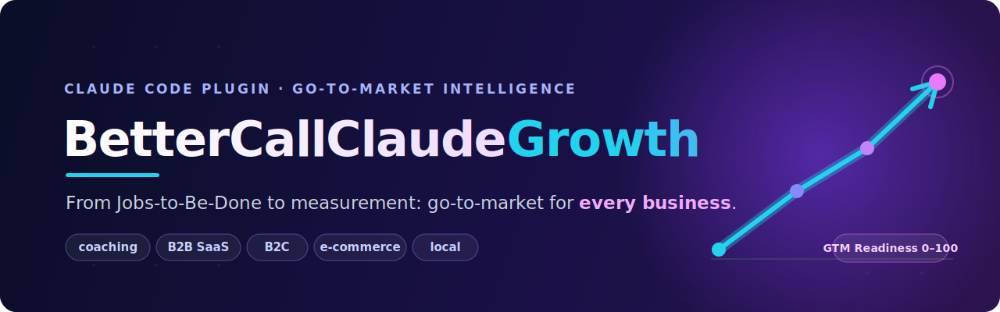

<p align="center">
  
</p>

# BetterCallClaudeGrowth — Plugin Go-To-Market (GTM) e marketing per Claude Code

[](LICENSE)
[](https://github.com/uppifyagency/bettercallclaudegrowth/releases)
[](https://docs.anthropic.com/en/docs/claude-code)
[](#)
[](#)
[](#)

> Un consulente **Go-To-Market** dentro il terminale. BetterCallClaudeGrowth trasforma **9 framework di marketing** tratti da libri in un assistente operativo che riconosce il tuo tipo di business e ti guida dal posizionamento alla misurazione. È il gemello GTM di **BetterCallClaude**, e gira **interamente in locale**: nessun server MCP, nessun hook, nessuna dipendenza di rete.

---

## Perché esiste

La maggior parte dei founder non ha un problema di idee. Ha un problema di **sequenza**: cosa fare prima, cosa dopo, e cosa ignorare. Compri cinque libri di marketing, ne applichi il 10%, e resti bloccato tra "ho un'offerta" e "ho clienti".

BetterCallClaudeGrowth chiude quel buco. Prende **9 framework collaudati** e li mette al lavoro **sul tuo caso specifico** — non in astratto. Niente teoria da slide: un piano, dei deliverable, un punteggio di prontezza, e una revisione critica che ti dice dove stai per sbagliare.

> *Smetti di leggere di marketing. Inizia a farlo.*

---

## Quickstart

Installa il plugin da Claude Code (due righe, in quest'ordine):

```
/plugin marketplace add uppifyagency/bettercallclaudegrowth
/plugin install bettercallclaudegrowth
```

Poi descrivi la tua situazione e lascia che il router ti indichi la strada:

```
/gtm-buddy lancio un coaching di nutrizione, parto da zero, budget minimo
```

Oppure esegui la pipeline completa su un caso reale:

```
/gtm SaaS B2B gestione ricambi per officine, 50 trial/mese, in crescita
```

---

## Cos'è

BetterCallClaudeGrowth è un **plugin per Claude Code** che mette al tuo fianco un consulente di **GTM strategy** e **AI marketing**. Non è un generatore di slogan: è un sistema che classifica il tuo **archetipo di business** e il tuo **stadio**, sceglie il **playbook** giusto e produce deliverable concreti — posizionamento, offerta, lead generation, contenuti, copywriting, canali, email, SEO, Instagram ads.

---

## Per chi è (qualsiasi business)

Il plugin **riconosce l'archetipo** e adatta il percorso. Funziona se sei:

| Tipo di business | Cosa ottieni |
| --- | --- |
| **Coaching / Servizio / Freelance** | Posizionamento da "Personal Monopoly", offerta premium, primi lead senza budget. |
| **B2B SaaS** | ICP affilato, Grand Slam Offer, pipeline lead, canali e metriche LTGP:CAC. |
| **Prodotto / Servizio B2C** | Messaggio che converte, contenuti, canali e funnel di acquisizione. |
| **E-commerce** | Offerta e bonus, campagne Instagram/Meta, email automation, SEO prodotto. |
| **Servizio locale / Small business** | Posizionamento territoriale, lead a costo zero, SEO/GEO locale, recensioni. |
| **Micro-lancio / Test di prodotto** | Validazione rapida, offerta minima, canale singolo, misura falsificabile. |
| **Azienda avviata _senza_ reparto marketing** | Un sistema GTM completo che colma il vuoto, con un punteggio di prontezza. |

Non importa da dove parti. **Il router capisce dove sei e ti dice il prossimo passo.**

---

## I due punti di ingresso

### `/gtm-buddy` — il router / concierge

Il modo più semplice per iniziare. Descrivi dove sei e dove vuoi arrivare: `gtm-buddy` classifica **archetipo × stadio**, ti dice se ti basta **una skill** o se ti serve una **sequenza**, e può eseguirla per te. È l'assistente che ti evita di indovinare da dove partire.

```
/gtm-buddy lancio un coaching di nutrizione, parto da zero, budget minimo
```

> Ti risponde come un consulente: *"Sei un coach allo stadio zero. Prima il posizionamento, poi l'offerta, poi i primi lead organici. Partiamo dal posizionamento?"*

### `/gtm` — la pipeline completa adattiva

Esegue un percorso end-to-end calibrato sul tuo caso:

- **Fase 0 — Classificazione**: rileva archetipo e stadio, sceglie il playbook.
- **7 fasi operative**: Jobs-to-Be-Done & posizionamento → Offerta → Lead → Contenuti & Copy → Canali → Email → Misura.
- **Due checkpoint di revisione avversariale** (`gtm-critic`) che fanno red-teaming di offerta, funnel, posizionamento e copy.
- **Sintesi PERCEIVE–ANALYZE–VALIDATE–ACT** con ipotesi falsificabili.
- **GTM Readiness Score 0–100** e deliverable finale **`gtm-plan.md`**.

```
/gtm abbonamento mensile box di caffè specialty, pre-lancio, lista da costruire
```

> *Da descrizione a piano, con la revisione critica già inclusa.*

---

## Gli 11 comandi

| Comando | Cosa fa | Framework / fonte |
| --- | --- | --- |
| `/gtm-buddy` | Router / concierge: classifica archetipo × stadio e instrada verso skill o sequenza | — |
| `/gtm` | Pipeline GTM completa adattiva + GTM Readiness Score | Tutti |
| `/gtm-jobs` | Jobs to Be Done: il "lavoro" che il cliente assume il tuo prodotto per svolgere | christensen-jobs |
| `/gtm-posizionamento` | ICP + Personal Monopoly: per chi sei la scelta ovvia | butcher-productize · doing-content-right |
| `/gtm-offerta` | Grand Slam Offer + Value Equation: un'offerta difficile da rifiutare | hormozi-offers |
| `/gtm-leads` | Core Four + lead magnet: far arrivare sconosciuti interessati | hormozi-leads |
| `/gtm-contenuti` | Strategia contenuti + calendario editoriale | doing-content-right |
| `/gtm-copy` | Copywriting con il framework SUCKS | drew-sucks-framework |
| `/gtm-email` | Email marketing automation: welcome, drip, winback | advanced-email-marketing |
| `/gtm-seo` | SEO + GEO 2026: Google e motori generativi (AI Overviews, LLM) | seo-2026-sota |
| `/gtm-instagram` | Campagne Meta / Instagram a conversione | instagram-performance-marketing |

---

## I 9 framework / skill

Ogni skill è una **knowledge base** che riformula i principi operativi di un libro o di una metodologia, pronta da applicare al tuo caso.

| Skill | Tema | Autore / fonte |
| --- | --- | --- |
| `christensen-jobs` | Jobs to Be Done | Clayton Christensen — *Competing Against Luck* |
| `butcher-productize` | Productize Yourself, scalare un servizio | Jack Butcher — *Visualize Value* |
| `hormozi-offers` | Grand Slam Offer, Value Equation, pricing | Alex Hormozi — *$100M Offers* |
| `hormozi-leads` | Core Four, lead magnet, Client-Financed Acquisition | Alex Hormozi — *$100M Leads* |
| `doing-content-right` | Contenuti, niche, Personal Monopoly | Steph Smith — *Doing Content Right* |
| `drew-sucks-framework` | Copywriting SUCKS per il web | Kieran Drew |
| `advanced-email-marketing` | Email automation, segmentazione, deliverability | Frangioni / AEMA |
| `seo-2026-sota` | SEO tecnica + GEO per LLM e AI Overviews | SEO/GEO 2026 |
| `instagram-performance-marketing` | Meta / Instagram conversion ads | Robert Thomas |

---

## I 3 agent

| Agent | Ruolo |
| --- | --- |
| `gtm-buddy` | Router / concierge. Classifica il tuo caso e ti instrada verso la skill o la sequenza corretta. |
| `gtm-orchestrator` | Guida la pipeline adattiva end-to-end e calcola il **GTM Readiness Score** 0–100. |
| `gtm-critic` | Revisore avversariale. Fa red-teaming di offerta, funnel, posizionamento e copy prima che tu ci spenda budget. |

> *Un consulente che propone. Un critico che ti salva.*

---

## I 4 script deterministici

Quattro script Node che producono numeri ripetibili, non opinioni. Stessi input, stesso output.

| Script | Output |
| --- | --- |
| `cfa-calculator` | Rapporto **LTGP:CAC** e modello **Client-Financed Acquisition** (Hormozi): la tua acquisizione si autofinanzia? |
| `value-equation-score` | Forza dell'offerta su scala **0–100** |
| `gtm-readiness-score` | **GTM Readiness Score** 0–100 della pipeline |
| `gtm-plan-lint` | Controllo di qualità e coerenza del `gtm-plan.md` |

A questi si aggiungono **7 playbook** specifici per archetipo, che calibrano ogni fase sul tuo tipo di business.

---

## Architettura

```
bettercallclaudegrowth/
├── commands/        # 11 comandi: /gtm-buddy, /gtm, /gtm-offerta, …
├── agents/          # 3 agent: gtm-buddy, gtm-orchestrator, gtm-critic
├── skills/          # 9 knowledge base (i framework dei libri)
├── playbooks/       # 7 playbook calibrati per archetipo × stadio
├── scripts/         # 4 script Node deterministici
└── assets/          # banner.svg e risorse
```

**Flusso tipico della pipeline `/gtm`:**

```
/gtm  ──►  Fase 0: classificazione (archetipo × stadio)
          │
          ▼
   selezione del playbook per archetipo
          │
          ▼
   7 fasi: JTBD/posizionamento ► offerta ► lead ► contenuti/copy ► canali ► email ► misura
          │                              │
          ▼                              ▼
   checkpoint gtm-critic          checkpoint gtm-critic
          │
          ▼
   sintesi PERCEIVE–ANALYZE–VALIDATE–ACT  ►  GTM Readiness Score  ►  gtm-plan.md
```

**Local-first per scelta:** nessun server MCP, nessun hook, nessuna chiamata di rete. Tutto gira dentro la tua sessione di Claude Code.

---

## Configurazione (`userConfig`)

Imposta una volta le preferenze e ogni comando le rispetta.

| Chiave | Significato | Esempi |
| --- | --- | --- |
| `output_language` | Lingua dei deliverable | `IT`, `EN` |
| `archetipo` | Tipo di business (o `auto`) | `coaching`, `b2b-saas`, `b2c`, `ecommerce`, `local-service`, `established-no-marketing` |
| `stadio` | Stadio di crescita (o `auto`) | `micro-launch`, `scaling`, `established` |
| `settore` | Settore merceologico | nutrizione, automotive, food, … |
| `default_channel` | Canale primario (o `auto`) | `seo`, `instagram`, `email` |
| `brand_voice` | Tono di voce del brand | diretto, premium, tecnico, friendly |

---

## Esempi d'uso

```
/gtm-buddy lancio un coaching di nutrizione, parto da zero, budget minimo

/gtm SaaS B2B gestione ricambi per officine, 50 trial/mese, in crescita

/gtm-offerta abbonamento mensile box di caffè specialty

/gtm-leads studio fotografico locale, voglio più richieste di preventivo

/gtm-seo blog di ricette plant-based, voglio comparire nelle AI Overviews

/gtm-instagram ecommerce di skincare, scalare le campagne a conversione
```

> Apri il terminale. Scrivi cosa vendi. Esci con un piano.

---

## FAQ

**A chi serve?**
A founder, solopreneur, coach, team di B2B SaaS, brand B2C ed e-commerce, attività locali e PMI avviate **senza reparto marketing**. Se devi portare qualcosa sul mercato, è per te.

**Devo conoscere il marketing per usarlo?**
No. `/gtm-buddy` fa da concierge: parti descrivendo la situazione a parole tue e il router ti dice esattamente quale skill o sequenza usare.

**Serve una connessione o un server MCP?**
No. Il plugin è **local-first**: nessun MCP, nessun hook, nessuna dipendenza di rete. Gira tutto nella tua sessione di Claude Code.

**Posso usare una sola skill senza la pipeline?**
Sì. Ogni comando (`/gtm-offerta`, `/gtm-copy`, `/gtm-seo`, …) funziona da solo. La pipeline `/gtm` è opzionale, per chi vuole il percorso completo.

**Mi serve un budget pubblicitario?**
No. Molti percorsi (organico, contenuti, outreach, SEO) sono pensati per partire a budget minimo. I paid ads sono un'opzione, non un obbligo.

**In che lingua produce i deliverable?**
In italiano o inglese, secondo `output_language`. Di default segue la tua configurazione.

**I deliverable sono affidabili?**
Le valutazioni numeriche (Value Equation, LTGP:CAC, GTM Readiness Score) sono prodotte da **script deterministici**: stessi input, stesso risultato. La parte strategica passa per i checkpoint avversariali di `gtm-critic`.

**Contiene il testo dei libri?**
No. Vedi la sezione **Crediti & Copyright** qui sotto.

---

## Crediti & Copyright

Le 9 skill di BetterCallClaudeGrowth sono **knowledge base** con framework e principi **riformulati** a scopo di studio e applicazione operativa. **Non contengono il testo integrale** dei libri di riferimento. Tutti i diritti sulle opere originali restano dei rispettivi autori ed editori.

Riconoscimenti agli autori i cui framework hanno ispirato questo plugin: Clayton Christensen, Jack Butcher (Visualize Value), Alex Hormozi, Steph Smith, Kieran Drew, Alessandro Frangioni (AEMA / ROADS®), Robert Thomas, e gli autori della trilogia SEO/GEO 2026.

Realizzato da **Uppify Agency** · Repo: **github.com/uppifyagency/bettercallclaudegrowth** · versione **0.3.0** · categoria **marketing**.

---

## Licenza

Distribuito con licenza **MIT**. Vedi il file [`LICENSE`](LICENSE). Usalo, modificalo, costruiscici sopra.

---

## Keyword / Topics

`go-to-market` · `GTM` · `GTM strategy` · `marketing` · `AI marketing` · `Claude Code plugin` · `Claude Code skill` · `Anthropic` · `product launch` · `positioning` · `offer` · `lead generation` · `copywriting` · `SEO` · `GEO` · `email marketing` · `Instagram ads` · `Meta ads` · `startup` · `founder` · `solopreneur` · `coaching` · `B2B SaaS` · `B2C` · `ecommerce` · `local business` · `small business` · `Jobs to Be Done` · `Grand Slam Offer` · `content strategy` · `marketing plugin` · `marketing skill`

<sub>BetterCallClaudeGrowth · v0.3.0 · il gemello go-to-market di BetterCallClaude · made by Uppify Agency</sub>
